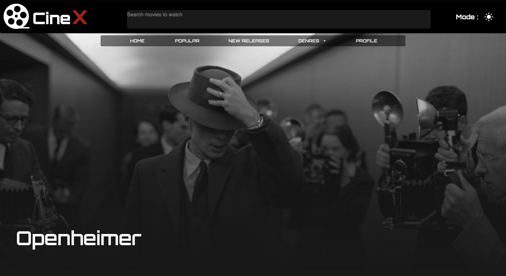
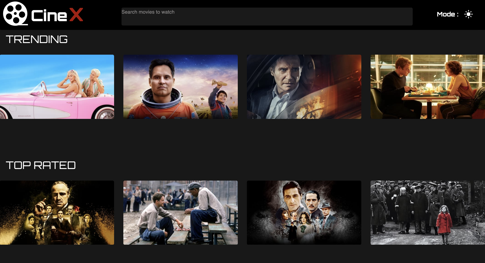
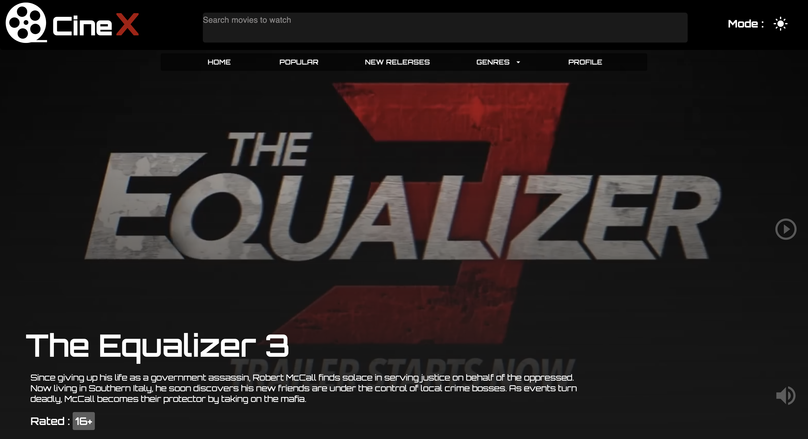
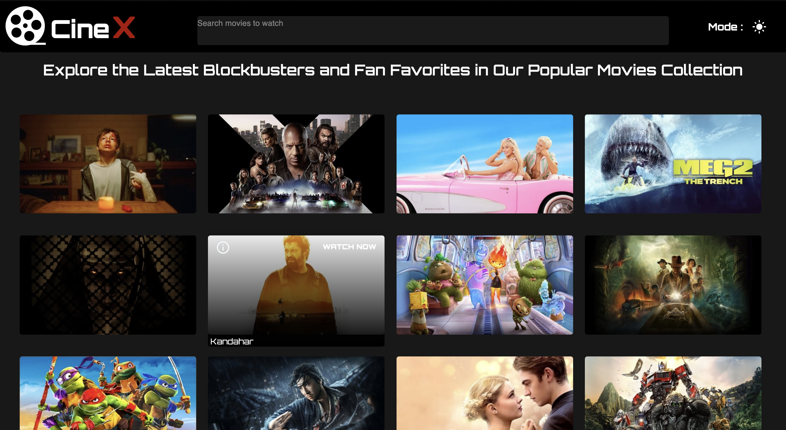
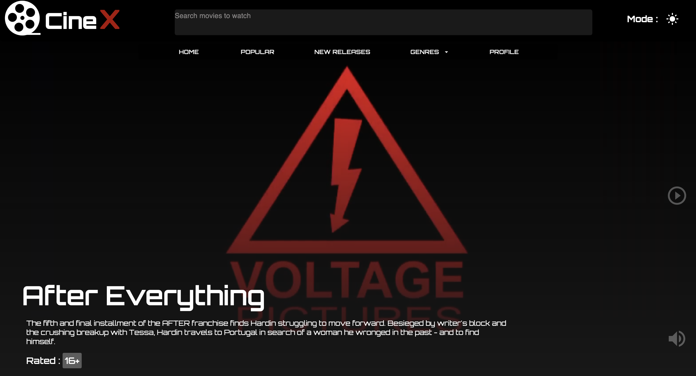
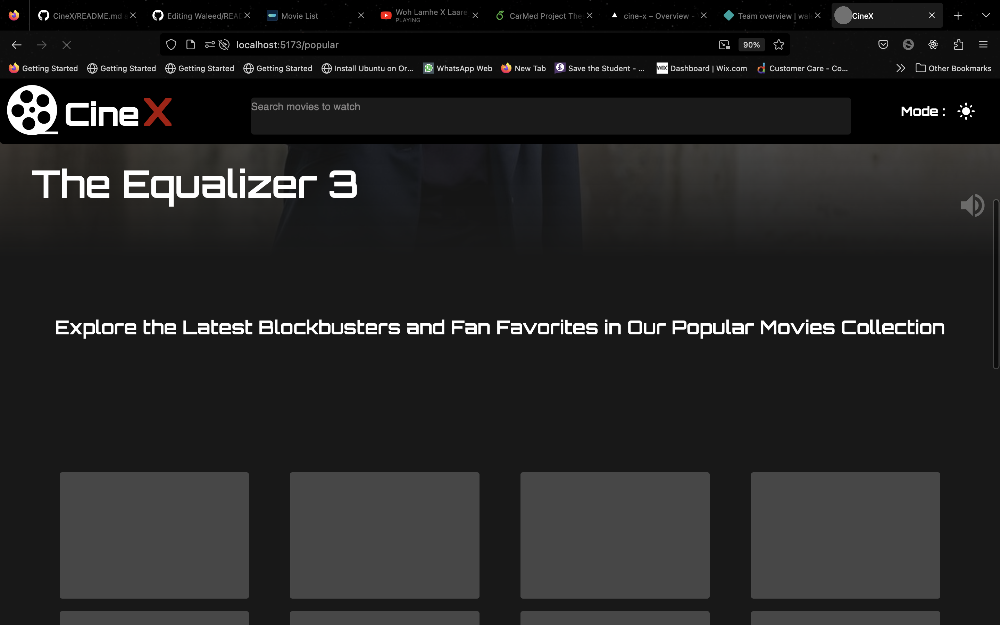
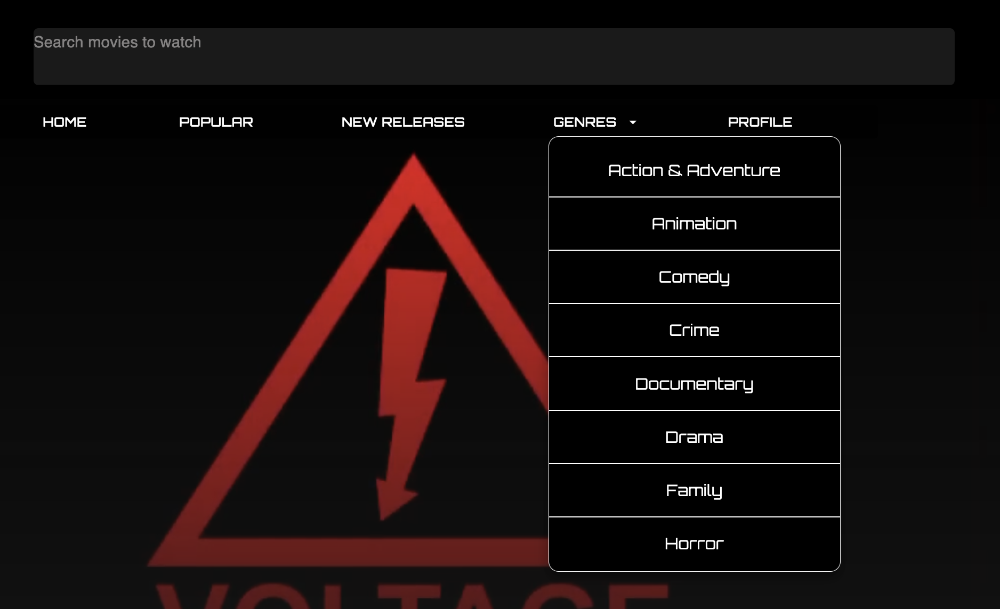
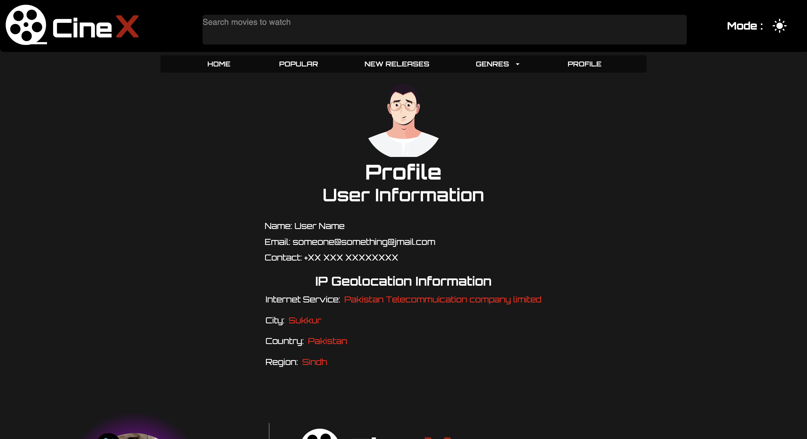

          # Cine X
- ( Incomplete = Non-Responsive )
~
- An entertainment website for Movies and TV Shows
#Polulated with TMBD API

# Tools & Libraries
# React
- useState
- useEffect
- useContext
- customHooks
- react-router-dom
- and much more
# SCSS
# Material UI
# Theme ( Dark & Light )
# Email js
# Live Animation
# Formik (Form Validation)
# Yup ( Schema for Formik )
# Axios
# Swiper js
# Framer-Motion
## Will implement 3 Language switching in the future ( English, Urdu, Arabic )

Visit Now: [Cine X](https://cinx.vercel.app/)

# Landing page tells you all about this app

Different nature of movies, documentaries, TV shows, and much more!!!

# Sliders where the content will not spread too much

# This section contains all the popular movies and shows of all time

Movies

# This section contains all the freshly released content

# Loading Skeleton added to every call-dependent component to throw an impression to the user to wait

# A vast number of genres to populate the app

# User's Information

Profile Where the user will get the information provided when DEMO SIGNUP

# Footer is currently under consideration to changes

