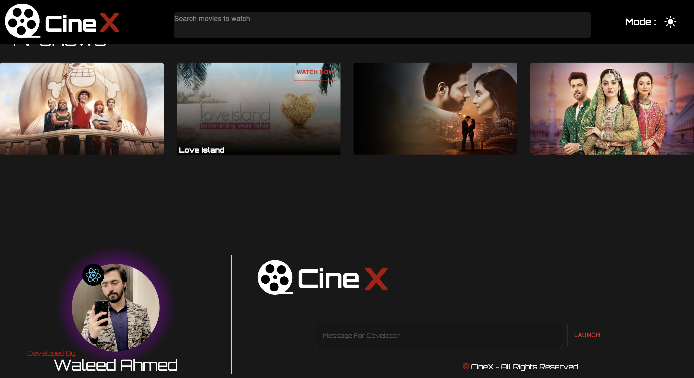

# Cine X

Cine X is an entertainment website dedicated to movies and TV shows. Although it's currently incomplete and non-responsive, it offers a glimpse into the world of cinema and television.

## Tools & Libraries

- **React**: Leveraging features like useState, useEffect, useContext, customHooks, and react-router-dom for a dynamic and seamless user experience.
- **SCSS**: Utilizing SCSS for efficient styling and maintainability.
- **Material UI**: Incorporating Material UI components for a polished and intuitive interface.
- **Theme**: Offering both Dark and Light themes for user preference.
- **Email JS**: Integrating Email JS for easy communication with users.
- **Live Animation**: Adding dynamic animations to enhance user engagement.
- **Formik**: Employing Formik for form validation and management.
- **Yup**: Utilizing Yup schema for Formik validation.
- **Axios**: Handling HTTP requests for data fetching.
- **Swiper js**: Incorporating Swiper js for smooth content sliding.
- **Framer-Motion**: Adding Framer-Motion for stunning motion effects.

In the future, we plan to implement three language options: English, Urdu, and Arabic.

## Visit Now

Explore Cine X now: [Cine X](https://cinx.vercel.app/)

# Landing Page

The landing page provides an overview of the app's features and offerings.

# Type Belt

A section dedicated to sliders to ensure content is presented in a concise manner.

# Popular Movies & Shows

Discover all-time popular movies and shows.

# Fresh Releases

Stay updated with freshly released content.

# Loading Skeleton

Enhanced user experience with loading skeleton for call-dependent components.

# Genres

Explore a vast number of genres available on the app.

# User Profile

Access user information and preferences.

# Footer

Footer section under consideration for future improvements.

Thank you for exploring Cine X! Feedback and suggestions are always welcome.
